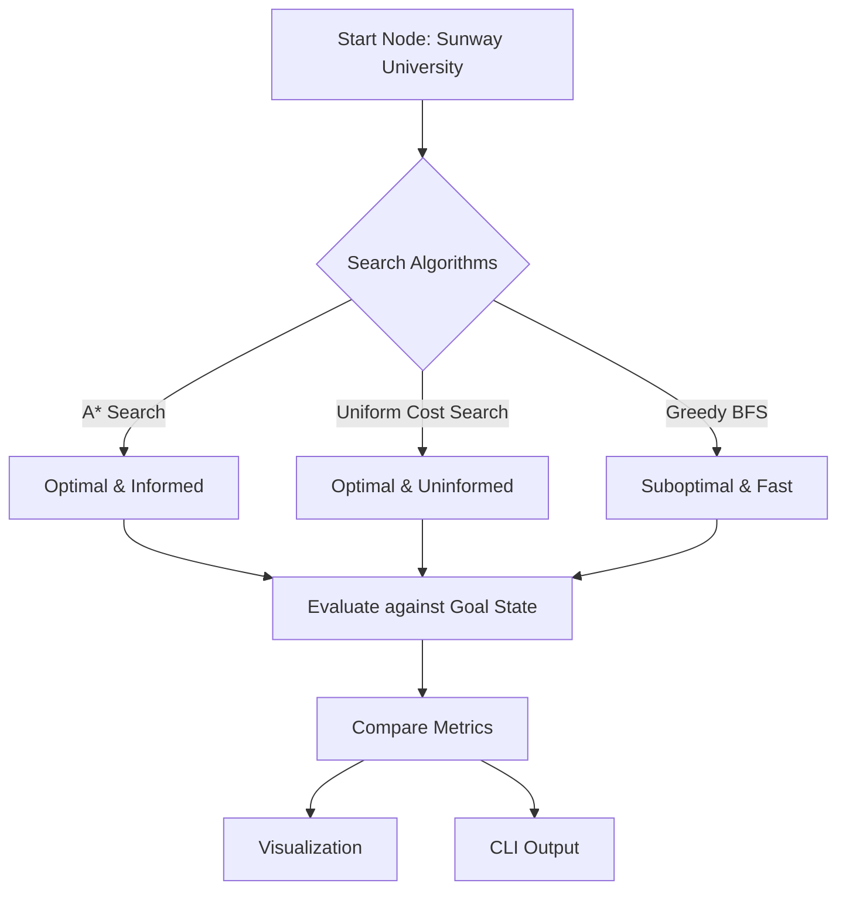
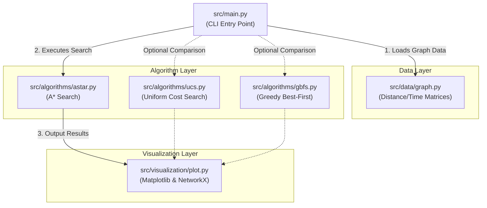

# 🗺️ House Visit Tour: AI Route Planning Implementation


> **Group 4 · Sunway University · May Semester 2026**  
> Deadline: **2 August 2026, 23:59**

---

## 📖 Project Context
This project implements an intelligent routing system designed to solve a variant of the Traveling Salesperson Problem (TSP). By leveraging advanced Artificial Intelligence search algorithms, our system determines the most efficient path for visiting multiple residential nodes. This has real-world applications in logistics, delivery routing, and urban planning.

---

## 👥 Group Members

| # | Name | Student ID | Role |
|---|------|-----------|------|
| M1 | Jaeden Ting Yiyong | 23009798 | Group Lead · Algorithm Integration |
| M2 | Evan Lo Jen Zhen | 23026842 | Report Compilation · Presentation |
| M3 | Wai Phyo Hein | 22108765 | Data Collection · Visualization |
| M4 | Sohom Chakma | 22107791 | A* Implementation |
| M5 | Raymond Tham Chun Keet | 19010461 | Problem Formulation · UCS |
| M6 | Chin Shaw Zhuong | 24153058 | GBFS Implementation |

---

## 📋 Problem Statement

Design a **house visit tour** starting from Sunway University that visits the residential locations of all 6 group members at least once, using an AI search algorithm to find the optimal route.

- **Start:** Sunway University (SU)
- **Goal:** Visit M1 → M2 → M3 → M4 → M5 → M6 (all at least once)
- **Optimization metric:** Driving distance (km) / driving time (min) / carbon emissions (kg CO₂e)

---

## 🗺️ Locations

| Node | Member | Address |
|------|--------|---------|
| SU | — | Sunway University, Bandar Sunway |
| M1 | Jaeden | No. 8 Jalan Jarak, Tanamera, Subang Jaya |
| M2 | Evan | No. 15 Jalan USJ Heights 6/1D, Subang Jaya |
| M3 | Wai | Sunway House Waterfront Residence, Bandar Sunway |
| M4 | Sohom | Edumetro, USJ1, Subang Jaya |
| M5 | Raymond | No. 15 Jalan Kasawari 4, Taman Eng Ann, Klang |
| M6 | Chin | Yolo Signature Suites, Petaling Jaya |

---

## 🤖 Algorithm Architecture & Selection

We evaluate three distinct search strategies to navigate our state space, balancing computational efficiency against path optimality.



> **Primary Choice: A\* Search**
> 
> Options from Assignment 1 analysis:
> - Uniform Cost Search (UCS) — uninformed, optimal
> - A\* Search with MST-based lower-bound heuristic — informed, optimal, efficient
> - Greedy Best-First Search (GBFS) — informed, fast but suboptimal

---

## 🚀 Quick Start

```bash
# 1. Clone the repo
git clone <repo-url>
cd csc3206-a2

# 2. Install dependencies
pip install -r requirements.txt

# 3. Run the algorithm
python src/main.py

# 4. Run with visualization
python src/main.py --visualize

# 5. Run all algorithms for comparison
python src/main.py --compare

# 6. Run the automated tests
python -m pytest -q
```

See [SETUP.md](docs/SETUP.md) for detailed environment setup.

---

## 🏛️ Software Architecture

Our codebase is structured into three main layers: **Data**, **Algorithms**, and **Visualization**. The central execution script `main.py` coordinates between these layers based on the user's CLI arguments.



### Architecture Breakdown
- **Data Layer**: Responsible for storing the distance matrices, time matrices, and carbon emission data. It provides helper functions to get neighboring nodes and path costs.
- **Algorithm Layer**: Contains the core logic for navigating the search space. Each algorithm module is isolated, taking the graph data and outputting a standardized dictionary of results (route taken, total cost, nodes expanded).
- **Visualization Layer**: Responsible for drawing the node map and overlaying the optimal route using `matplotlib` and `networkx`. 

---

## 📁 Repository Structure

```
csc3206-a2/
├── README.md               # This file
├── requirements.txt        # Python dependencies
├── .gitignore
│
├── src/
│   ├── main.py             # Entry point
│   ├── algorithms/
│   │   ├── __init__.py
│   │   ├── ucs.py          # Uniform Cost Search
│   │   ├── astar.py        # A* Search
│   │   └── gbfs.py         # Greedy Best-First Search
│   ├── data/
│   │   ├── __init__.py
│   │   └── graph.py        # Distance/time matrices + graph builder
│   └── visualization/
│       ├── __init__.py
│       └── plot.py         # Route plotting & result display
│
├── tests/
│   └── test_algorithms.py  # Unit and integration tests
│
├── docs/
│   ├── ALGORITHM_IMPLEMENTATION.md # Detailed algorithm & execution docs
│   ├── SETUP.md            # Environment & execution guide
│   ├── FORMULATION.md      # AI problem formulation reference
│   ├── TESTING.md          # Test suite and edge case documentation
│   └── TASKS.md            # Task board (this sprint)
│
└── assets/
    ├── .gitkeep
    └── route_output.png    # Generated by --visualize
```

---

## 📊 Expected Output

The program should print and/or display:

1. **Optimal route** — ordered sequence of nodes visited (e.g. `SU → M6 → M3 → M4 → M1 → M2 → M5` for distance)
2. **Total cost** — cumulative distance (km), time (min), or carbon emissions (kg CO₂e)
3. **Nodes expanded** — for algorithm comparison
4. **Visualization** — map plot with the route highlighted

---

## 📎 Links

| Resource | Link |
|----------|------|
| Assignment 1 Report | https://imailsunwayedu-my.sharepoint.com/:w:/g/personal/23009798_imail_sunway_edu_my/IQBguXAhSRcyT5rrHltDkCVjAfpikQIpFefglSySi0ocdHg?e=ffla6l |
| Presentation Video | https://imailsunwayedu-my.sharepoint.com/:v:/g/personal/23026842_imail_sunway_edu_my/IQAa8K_sFLQ5RYlf-EZXpodFAV3MtIZd1QIeLSBAxYnR6Ss?nav=eyJyZWZlcnJhbEluZm8iOnsicmVmZXJyYWxBcHAiOiJTdHJlYW1XZWJBcHAiLCJyZWZlcnJhbFZpZXciOiJTaGFyZURpYWxvZy1MaW5rIiwicmVmZXJyYWxBcHBQbGF0Zm9ybSI6IldlYiIsInJlZmVycmFsTW9kZSI6InZpZXcifX0%3D&e=5Pmhwp |
| Canva Slides | https://canva.link/fu0jfgianwirbze |
| Route Data Screenshots | https://drive.google.com/drive/folders/1xq3B728VkbJXb60iyc9JwS9Vem1cD271 |

---

## 📝 Submission Checklist

- [x] Code executes without errors
- [x] Output displays the solution (text + graphical)
- [x] README / SETUP.md with execution instructions
- [x] Automated tests pass (`15 passed`)
- [ ] Report with all required sections
- [ ] Presentation video (≤10 min) uploaded to OneDrive/Google Drive
- [ ] Video link included in report appendix
