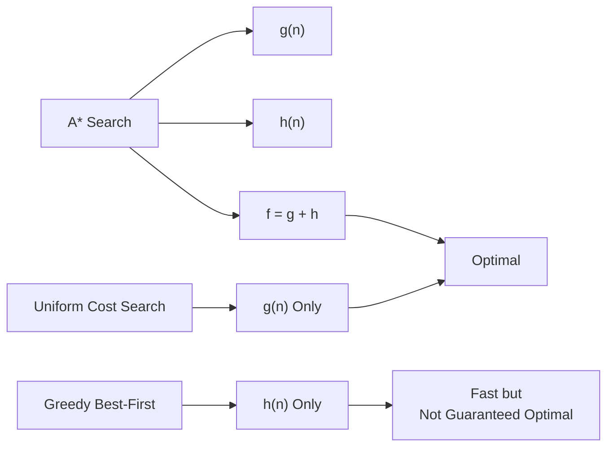
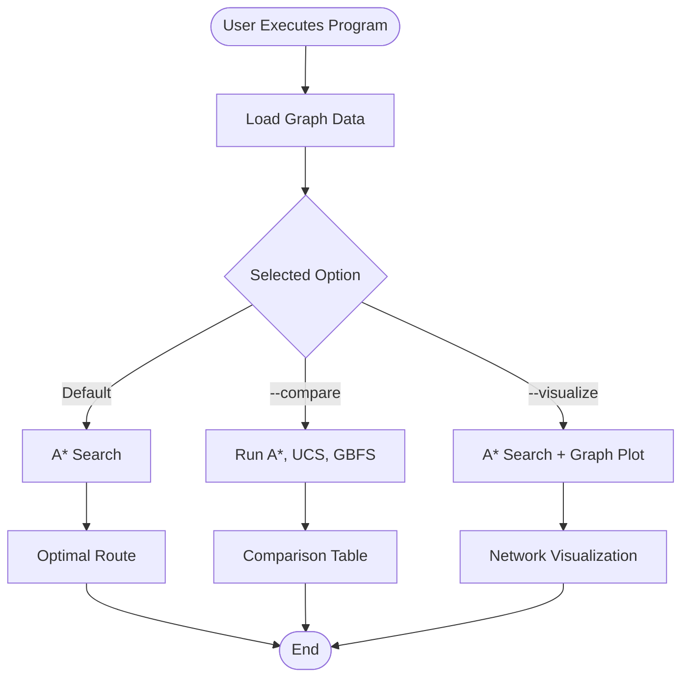

# 🧠 Search Algorithm Implementation

This document provides a detailed explanation of the search algorithms implemented in this project to solve the House Visit Tour problem.

## 1. State Representation

In this problem, the agent needs to find an optimal route to visit all group members. The state is represented as a tuple:

```python
State = (current_location: str, visited_members: frozenset)
```

- **`current_location`**: The node the agent is currently at (e.g., `"SU"`, `"M1"`).
- **`visited_members`**: A `frozenset` tracking which group members have already been visited. A `frozenset` is used because it is immutable and hashable, allowing the state to be safely stored as a key in the `explored` dictionary.

**Goal State:**
The goal is achieved when `visited_members` contains all 6 group members `{"M1", "M2", "M3", "M4", "M5", "M6"}`.

---

## 2. A* Search Algorithm

The primary algorithm chosen for finding the optimal route is **A* Search**. A* is an informed search algorithm that uses a heuristic to guide the search, making it significantly more efficient than uninformed algorithms like Uniform Cost Search (UCS).

### 2.1 The Evaluation Function $f(n)$

A* explores nodes based on the evaluation function:

$$ f(n) = g(n) + h(n) $$

- **$g(n)$**: The exact cumulative cost (e.g., distance in km or time in mins) from the start node (`"SU"`) to the current node $n$.
- **$h(n)$**: The heuristic estimate of the cost from node $n$ to the goal.

### 2.2 The Heuristic: MST-Based Lower Bound

To ensure A* is **optimal**, the heuristic $h(n)$ must be **admissible** (meaning it never overestimates the true cost to reach the goal). We use the **Minimum Spanning Tree (MST)** heuristic calculated using Prim's algorithm.

**How it works:**
1. Given the current `location` and the set of `remaining_unvisited` members.
2. If there is only one remaining member, the heuristic returns the exact direct cost from the current location to that member.
3. If multiple members remain, the heuristic adds the cheapest outgoing edge from the current location to any remaining member.
4. It then computes an MST over the remaining members using the cheaper available direction between each pair as an undirected lower-bound edge.
5. The outgoing lower bound plus the MST cost serves as $h(n)$.

Because the route graph is directed and asymmetric, the MST must not use raw directed edges as though they were symmetric. Using the cheaper direction for each undirected pair guarantees that each MST edge is no more expensive than the corresponding directed edge used by any valid route. Therefore, the heuristic remains a lower bound and is empirically tested for every reachable state.

### 2.3 Python Implementation of A*

```python
def astar(metric: str = "distance") -> dict:
    start_state = ("SU", frozenset())
    goal_visited = frozenset(MEMBERS)

    # Priority queue stores tuples: (f(n), g(n), state, path)
    start_h = heuristic(start_state, metric)
    frontier = [(start_h, 0.0, start_state, ["SU"])]
    heapq.heapify(frontier)

    explored = {}  # state -> best g(n)

    while frontier:
        f, g, state, path = heapq.heappop(frontier)
        location, visited = state

        # Skip sub-optimal paths to already explored states
        if state in explored and explored[state] <= g:
            continue
        explored[state] = g

        # Goal Check
        if visited == goal_visited:
            return {"route": path, "total_cost": g}

        # Expand Node
        for neighbour in get_neighbours(location):
            edge_cost = get_cost(location, neighbour, metric)
            new_g = g + edge_cost
            
            # Update visited set if the neighbour is a member node
            new_visited = visited | {neighbour} if neighbour in MEMBERS else visited
            new_state = (neighbour, new_visited)

            # Only add to frontier if it's a new state or we found a cheaper path to it
            if new_state not in explored or explored[new_state] > new_g:
                new_h = heuristic(new_state, metric)
                new_f = new_g + new_h
                heapq.heappush(frontier, (new_f, new_g, new_state, path + [neighbour]))
```

---

## 3. Alternative Algorithms

For comparison and algorithmic evaluation purposes, two other algorithms are also implemented:



### 3.1 Uniform Cost Search (UCS)
- **Uninformed**: Expands nodes based strictly on the path cost $g(n)$.
- **Optimality**: Guaranteed to find the optimal path.
- **Drawback**: Without a heuristic to guide it, UCS expands a significantly larger number of nodes radially in all directions, making it slower and more memory-intensive than A*.

### 3.2 Greedy Best-First Search (GBFS)
- **Informed**: Expands nodes based solely on the heuristic $h(n)$, entirely ignoring the cumulative cost $g(n)$.
- **Speed**: Very fast as it aggressively heads toward the goal nodes.
- **Drawback**: Suboptimal. It can easily get trapped in local optima or choose longer overall paths because it doesn't consider the distance it has already traveled.

---

## 4. How to Run the Algorithms

You can execute the implemented algorithms via the central command-line interface in `src/main.py`.



### 4.1 Prerequisites
Ensure your virtual environment is active and dependencies are installed:
```bash
pip install -r requirements.txt
```

### 4.2 Running the Default Algorithm (A*)
To execute the primary optimal A* algorithm and view the path:
```bash
python src/main.py
```

### 4.3 Visualizing the Route
To visualize the calculated optimal route on a node graph:
```bash
python src/main.py --visualize
```

### 4.4 Algorithm Comparison
To run all three algorithms (A*, UCS, and GBFS) simultaneously and print a comparison table detailing their overall costs, generated routes, and number of nodes expanded:
```bash
python src/main.py --compare
```
